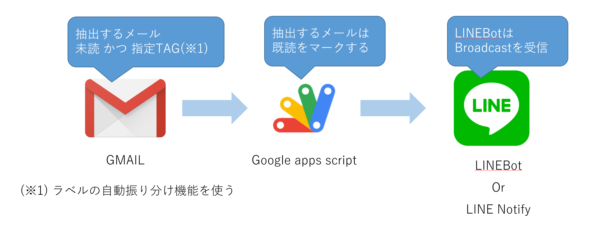
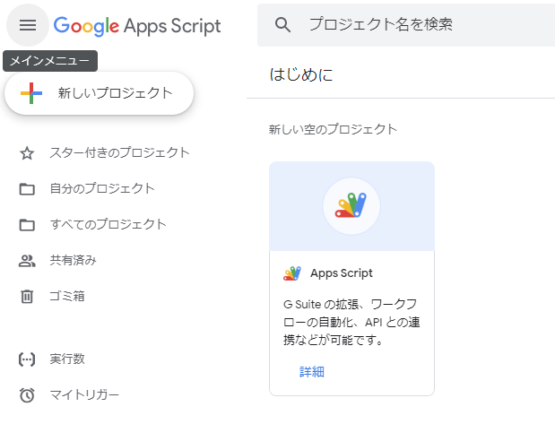
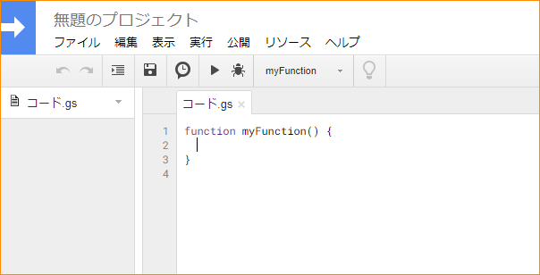
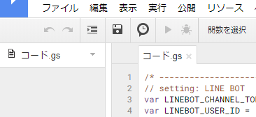
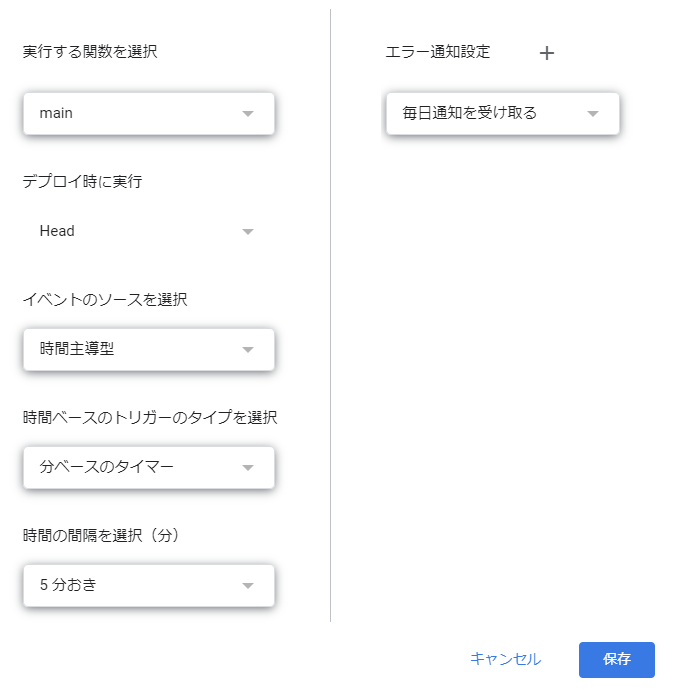

# GMail to Line Bot
GMAILを指定指定条件で検索した結果をLINE BOTに通知する。



# version
| date     | ver | note |
| -------- | --- | -----|
|2020-07-08|v1.0.0||
|2020-07-08|v0.0.2|label複数条件の設定方法を追記|

# Prerequisites

- registration line-developers

    Messaging API利用 [こちらから](https://developers.line.biz/ja/)

    フリープランOK
    - 月額利用料： 無料
    - メッセージ配信数（無料分）: 1000通
    - 追加メッセージ料金: 追加購入不可

- registration google account

    google Apps Script利用　[こちらから](https://www.google.com/accounts/NewAccount?hl=ja)

# Preparation

1) line-developersログイン

    [line-developers](https://developers.line.biz/ja/)を開いて、ログインする。

2) Provider選択

    Providerがない場合、CreateしてProviderをクリックする。

2) Create a channel
    
    Messaging APIを選択し、必要情報を入力してCreateする。
    Messaging API settingsの「Channel access token」は後で使います。

# Program

1) 新しい空のプロジェクトを作成

    [google apps Script](https://script.google.com/home/start)を開いて、新しい空のプロジェクトをクリックする。

    

2) ソースコード

    Apps Scriptのエディタにソース(main.gs)を貼り付ける。

    

    - LINEBOT_CHANNEL_TOKEN : Messaging API settingsのChannel access tokenから取得したもの
    - LINE_NOTIFY_TOKEN : LINE Notifyを使う場合はこちら
    - GMAIL_QUERY : gmailのラベル名を指定する

        ```javascript
        /* ------------------------------------------------------- */
        // setting: LINE BOT
        var LINEBOT_CHANNEL_TOKEN = 'XXXXXXXXXXXXXXXX'; 

        // setting: Line Notify ※必要であれば
        var LINE_NOTIFY_TOKEN = "XXXXXXXXXXXXXXXX";

        // setting: GAMIL ※未読 かつ ラベル名
        var GMAIL_QUERY = "is:unread label:ラベル名";
        /* ------------------------------------------------------- */
        ```

3) トリガー作成

    時計アイコンをクリックする。

    


    以下設定を参考に保存する。

    


# Note
特になし